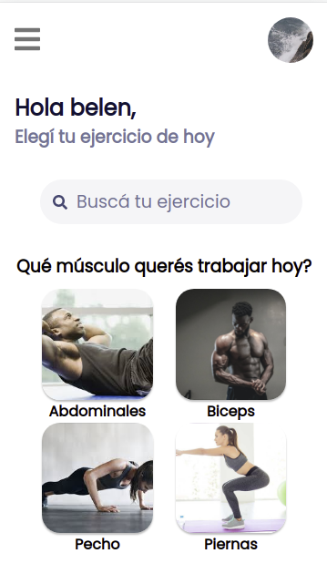
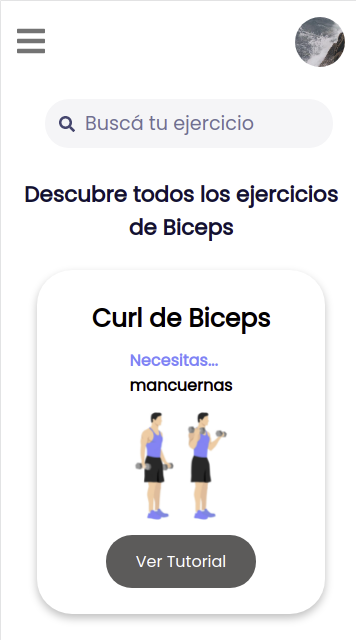

# ItesaFit

PWA workout application that uses movenet pretrained ML model to estimate poses and count repetitions. There´s also an augmented reality section where you can scan gatorade and cocaCola bottles.

### Screenshots

### Built with:

- Frontend: React.js, Recoil, CSS Modules
- Backend: Firebase
- Other: Tensorflow.js, MindAr

### Usage:

- Run yarn install
- Run npm run start
- Use responsive design mode on the browser
